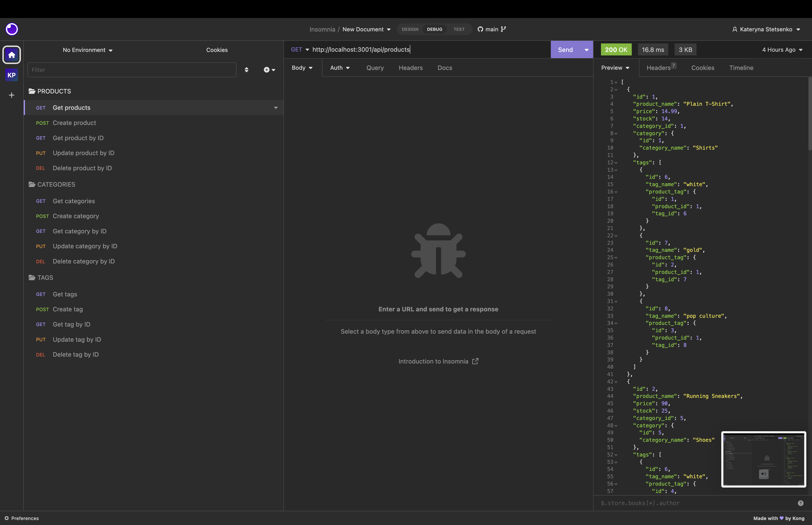
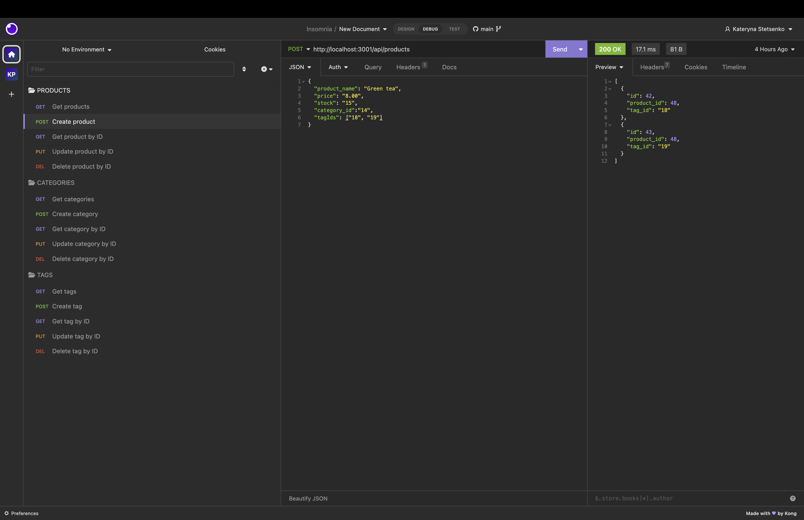
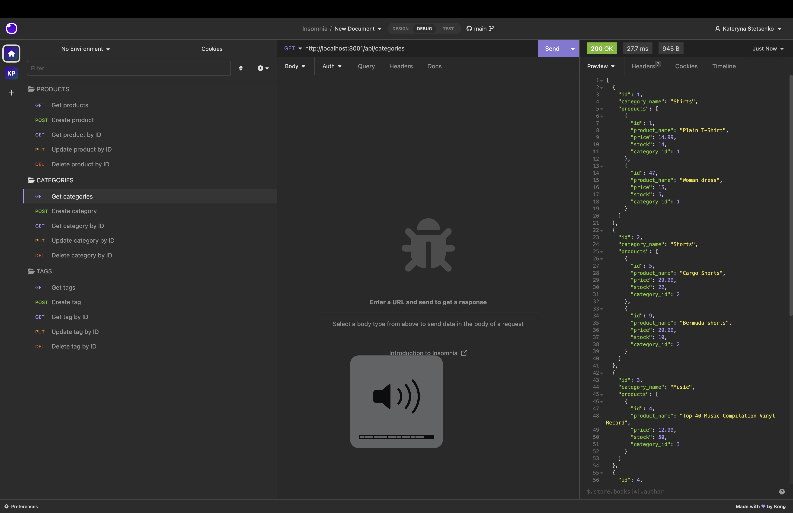
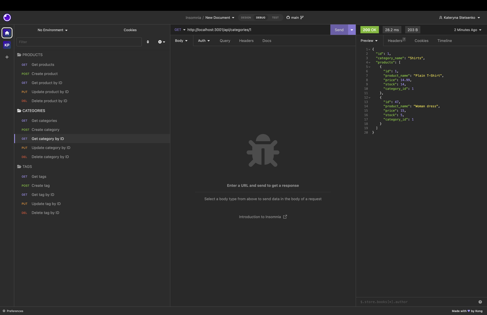
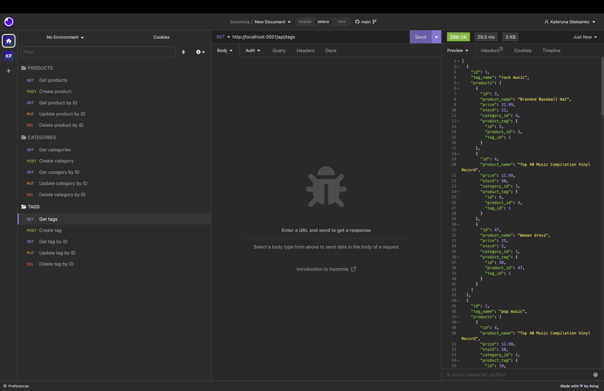

# shop-nerd

## Description

This is an e-commerce back end application that uses Express.js API and Sequelize to interact with a MySQL database.
With this back end, users can easily add, update, and delete products, categories, and tags. The application uses Sequelize, an ORM tool that makes working with databases easier.

Deployed application link on GitHub
https://github.com/itcreativeusa/shop-nerd

Youtube video guide
https://youtu.be/F5iqHqeqg1w

## Table of Contents

- [Installation](#installation)
- [Requirements](#requirements)
- [Usage](#usage)
- [Mock-Up](#mock-up)
- [Credits](#credits)
- [License](#license)

## Installation

Need to install Insomnia application to test API POST, PUT, and DELETE routes.

## Requirements

No special requirements

## Usage

Use command-line to run the application.
Run `npm install` to install the required dependencies.
Set up a MySQL database.
Update the configuration in the `.env` file.
Run the database using `node seeds/index.js` to create the necessary tables.
Run `npm start` to start the server.
Open Insomnia application to test API POST, PUT, and DELETE routes.

## Mock-Up

Screenshots located in `./assets/` folder.

The following screenshot shows the application's GET routes to return all products being tested in Insomnia:

The following screenshot shows the application's POST routes to create a new product being tested in Insomnia:

The following screenshot shows the application's GET routes to return all categories being tested in Insomnia:

The following screenshot shows the application's GET routes to return category by ID being tested in Insomnia:

The following screenshot shows the application's GET routes to return all tags being tested in Insomnia:

## Credits

Starter code files for this application provided by Berkeley Bootcamp for studying purposes.

## License

Please refer to the LICENSE in the repo.
