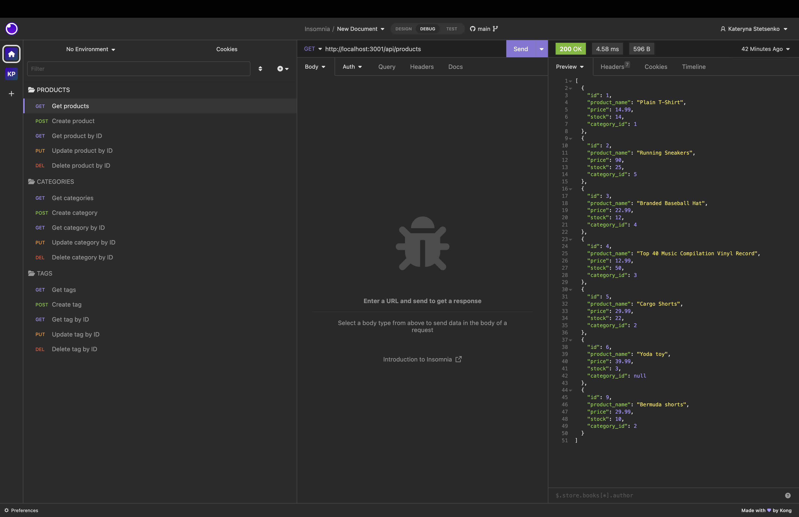
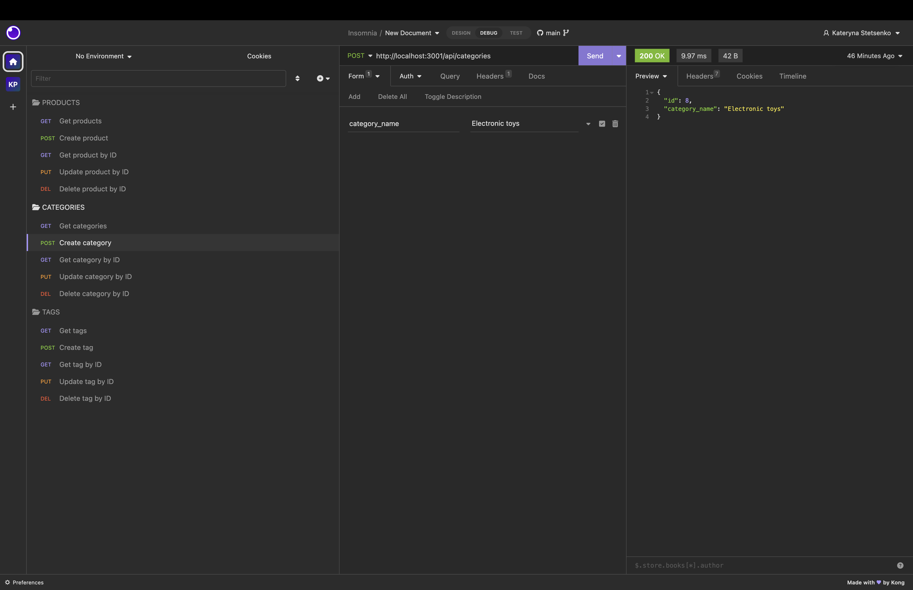
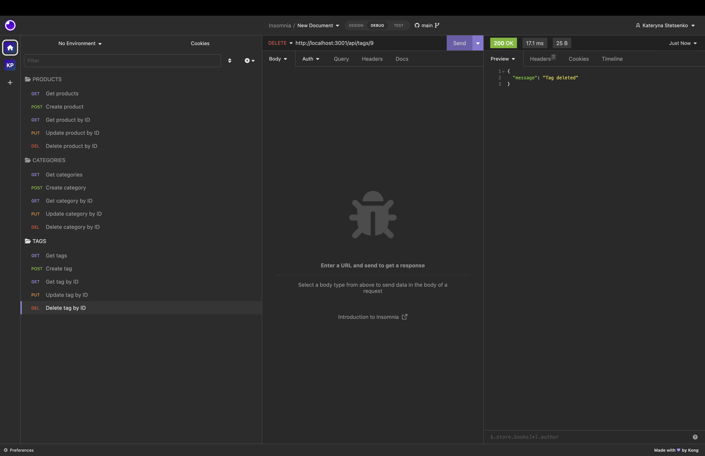

# shop-nerd

## Description

Deployed application link on GitHub
https://github.com/itcreativeusa/shop-nerd

Youtube video guide
https://youtu.be/EFswqMyVQc8

npm start

## Table of Contents

- [Installation](#installation)
- [Requirements](#requirements)
- [Usage](#usage)
- [Mock-Up](#mock-up)
- [Credits](#credits)
- [License](#license)

## Installation

Need to install Insomnia application to test API POST, PUT, and DELETE routes.

## Requirements

No special requirements

## Usage

Use command-line to run an application `npm start` to start the server.

Open Insomnia application to test API POST, PUT, and DELETE routes.

## Mock-Up

Screenshots located in `./assets/` folder.

The following screenshot shows the application's GET routes to return all products being tested in Insomnia:

The following screenshot shows the application's POST routes to create a new category being tested in Insomnia:

The following screenshot shows the application's DELETE routes to delete a tag being tested in Insomnia:

## Credits

Starter code files for this application provided by Berkeley Bootcamp for studying purposes.

## License

Please refer to the LICENSE in the repo.
